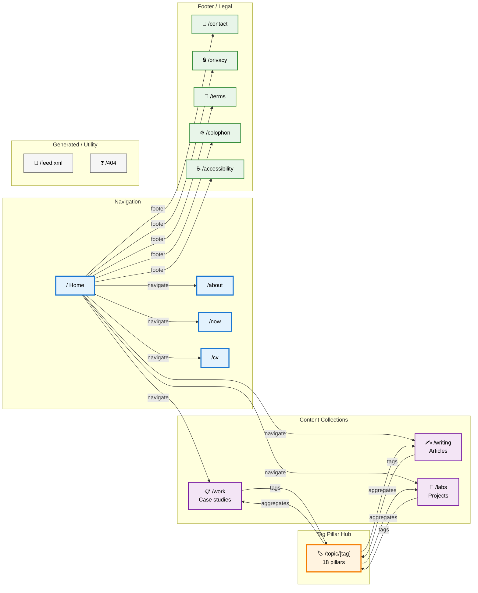

# Sitemap diagram — canopy

Visual reference: see Mermaid diagram at end of this file.

## ASCII flowchart

```
┌─────────────────────────────────────────────────────────────────┐
│                      HOME PAGE (/)                              │
│  Hero + Selected work (3) + Recent thinking (2-3) + Footer     │
└─────────────────────────────────────────────────────────────────┘
           ↓                    ↓                     ↓
      ┌────────────┐    ┌──────────────┐      ┌───────────┐
      │   /work    │    │  /writing    │      │   /labs   │
      │ ~15 cases  │    │ ~15-20 articles     │ ~5-10     │
      │            │    │  featured + chron   │ projects  │
      └────────────┘    └──────────────┘      └───────────┘
           ↓                    ↓                     ↓
      ┌────────────┐    ┌──────────────┐      ┌───────────┐
      │ [case/slug]│    │ [article/slug│      │ [lab/slug]│
      │            │    │   with notes │      │           │
      │ tags →     │    │   tags →     │      │ tags →    │
      └────────────┘    └──────────────┘      └───────────┘
           ↓                    ↓                     ↓
      ┌────────────────────────────────────────────────┐
      │    /topic/[tag]  (18 pillar pages)            │
      │                                                │
      │  Hub aggregates:                             │
      │  - Case studies with tag                     │
      │  - Articles with tag                         │
      │  - Labs with tag                             │
      │  - Intro paragraph (once 5+ pieces)          │
      └────────────────────────────────────────────────┘
      
      ↓                    ↓                    ↓
    /about              /now                 /cv
    - Narrative          - Status             - PDF download
    - Values grid        - Reading            - HTML summary
    - V&V framework      - Side projects
    - Indie hacker       - Last updated
    - Contact

  (footer on all pages)
    - /contact
    - /privacy
    - /terms
    - /colophon
    - /accessibility
```

## Hub-and-spoke mechanic (AEO foundation)

```
                    /topic/regulatory-service-design
                              ↓ ↑
                         (pillar page)
                              
        /work/[slug] ←link via tag→ /writing/[slug]
                │                        │
                ├→ tags: [reg-sd, ...]  ├→ tags: [reg-sd, ...]
                │                        │
                └→ shows: "see also"    └→ shows: "see also"
                   related articles       related cases
                   
        /labs/[slug]
             │
             ├→ tags: [reg-sd, ...]
             │
             ├→ links to: companion /writing/[slug]
             │
             └→ shown on: /topic/regulatory-service-design
                        as "Project" entry
```

Every piece of content (case study, article, lab) links *to* its tag pillar(s).
Every tag pillar page *aggregates and displays* all three content types sharing that tag.
Result: rich cross-linking for topical authority (AEO/SEO).

## Routes (complete)

### Public-facing

```
/                              Home
/work                          Case studies listing
/work/[slug]                   Case study detail
/writing                       Articles listing
/writing/[slug]                Article detail
/labs                          Projects listing
/labs/[slug]                   Project detail
/about                         About Dale
/topic/[tag]                   Tag pillar (18 total)
/now                           "What I'm doing now" status
/cv                            CV / résumé (PDF)
```

### Footer / Legal

```
/contact                       Contact form + email + social
/privacy                       Privacy notice
/terms                         Terms of service
/colophon                      Build notes / stack / credits
/accessibility                 Accessibility statement (WCAG)
```

### Generated/static

```
/sitemap.xml                   Standard sitemap (auto-generated)
/robots.txt                    Standard robots.txt
/llms.txt                      AI crawler optimization (site summary)
/feed.xml                      RSS/Atom feed for articles
```

### Error

```
/404                           Custom branded error page
```

## Mermaid diagram


